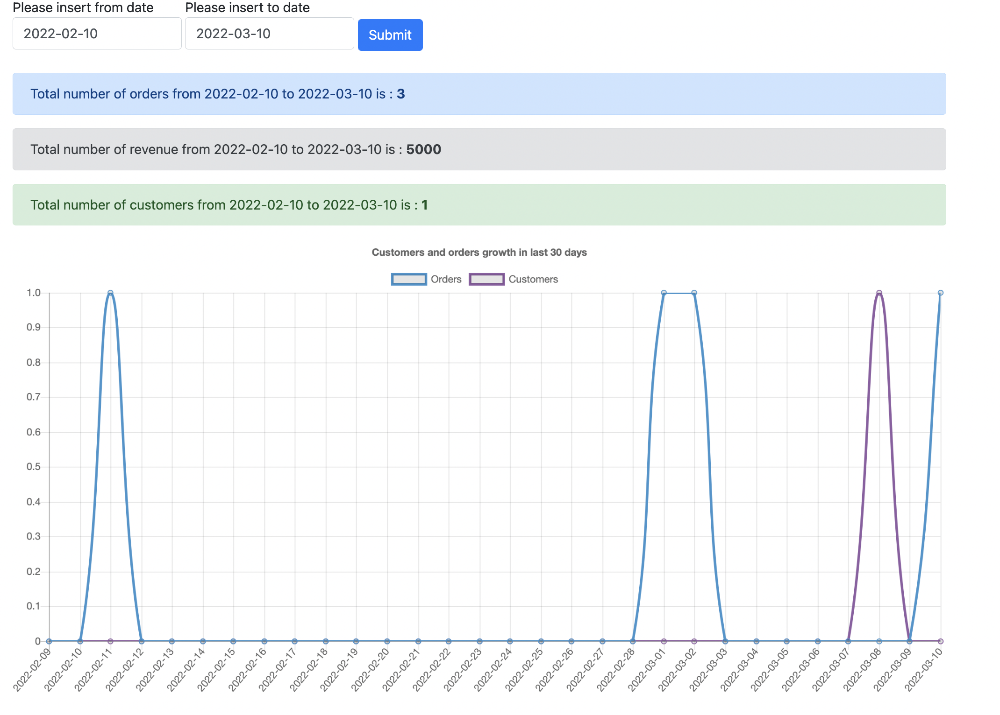

## Requirements

- docker version 20.10.8
- docker-compose version 1.29.2

## Installation


```bash
docker-compose up -d
```

## Usage

- website address: localhost:8080
  

- phpmyadmin address: localhost:8083


## You want to make it better ?

- caching database queries related to chart data.
- adding date picker in front-end.
- adding ORM.
- adding logger.
- adding routes.
- adding tests.
